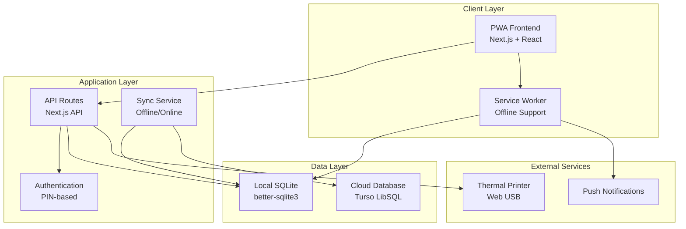
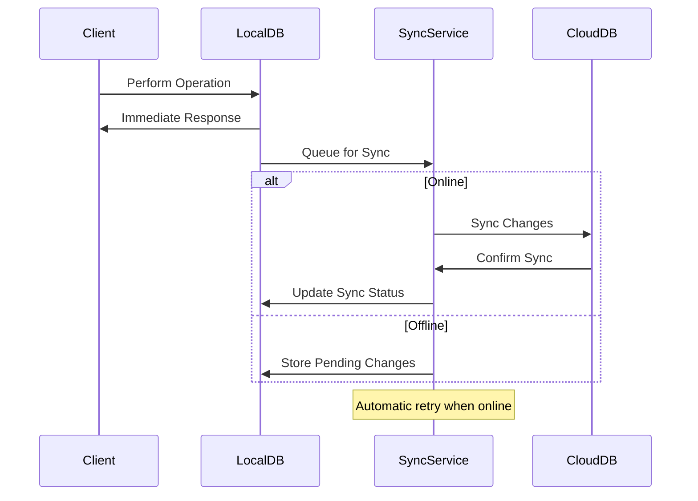
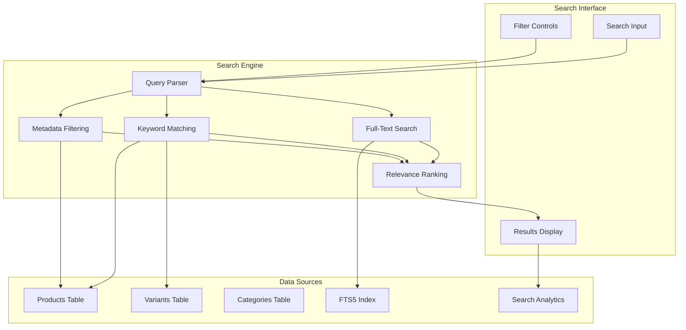

# Design Document

## Overview

VaikunthaPOS is designed as a modern Progressive Web App (PWA) using Next.js 14 with App Router, providing a comprehensive Point of Sale solution for ISKCON Asansol Temple's Gift & Book Store. The system follows an offline-first architecture with automatic cloud synchronization, ensuring continuous operation regardless of internet connectivity. The application uses a dual-database approach with local SQLite for offline operations and Turso (LibSQL) for cloud synchronization across multiple devices.

## Architecture

### High-Level Architecture



### Database Architecture

The system uses a dual-database approach for optimal offline-first functionality:

**Local Database (SQLite)**
- Primary data store for all operations
- Immediate consistency for user interactions
- Offline transaction storage
- Local user session management

**Cloud Database (Turso LibSQL)**
- Central data repository for multi-device sync
- Conflict resolution using timestamp-based priority
- Backup and recovery capabilities
- Cross-device data consistency

### Sync Strategy



### Search Architecture

The search system implements a multi-layered approach for optimal product discovery:



#### Search Features

1. **Full-Text Search (FTS5)**
   - SQLite FTS5 virtual table for fast text search
   - Supports phrase queries, prefix matching, and boolean operators
   - Automatic stemming and tokenization

2. **Keyword System**
   - Product-specific keywords for alternative names and synonyms
   - Category keywords for broader search coverage
   - Variant-specific keywords for detailed product attributes

3. **Metadata Filtering**
   - Custom product attributes (author, publisher, material, etc.)
   - Dynamic filter generation based on available metadata
   - Range filtering for numerical attributes

4. **Search Ranking Algorithm**
   ```typescript
   function calculateRelevanceScore(product: Product, query: string): number {
     let score = 0;
     
     // Exact name match gets highest score
     if (product.name.toLowerCase() === query.toLowerCase()) score += 100;
     
     // Name contains query
     if (product.name.toLowerCase().includes(query.toLowerCase())) score += 50;
     
     // Keyword matches
     const keywordMatches = product.keywords.filter(k => 
       k.toLowerCase().includes(query.toLowerCase())
     ).length;
     score += keywordMatches * 25;
     
     // Description matches
     if (product.description?.toLowerCase().includes(query.toLowerCase())) score += 10;
     
     // Category matches
     if (product.category.keywords.some(k => 
       k.toLowerCase().includes(query.toLowerCase())
     )) score += 15;
     
     // Popularity boost (based on sales frequency)
     score += product.salesCount * 0.1;
     
     return score;
   }
   ```

5. **Multi-language Support**
   - Hindi and Bengali keyword support
   - Transliteration for local language searches
   - Unicode normalization for consistent matching

## Components and Interfaces

### Core Components

#### 1. Authentication System
- **PIN-based Authentication**: Custom implementation using bcryptjs for secure PIN hashing
- **Role-based Access Control**: Three-tier system (Admin, Manager, Cashier)
- **Session Management**: JWT-like tokens stored in secure HTTP-only cookies
- **Auto-logout**: Configurable timeout with activity tracking

#### 2. Sales Transaction Engine
- **Shopping Cart Management**: Zustand store for cart state with persistence
- **Product Selection**: Touch-optimized product grid with variant support
- **Payment Processing**: Cash and UPI payment method handling
- **Receipt Generation**: Thermal printer integration and PDF fallback

#### 3. Inventory Management System
- **Product Catalog**: CRUD operations with category organization and comprehensive search
- **Variant Support**: Size, color, and custom attribute management with variant-specific keywords
- **Stock Tracking**: Real-time inventory updates with low-stock alerts
- **Category Management**: Hierarchical category structure with category-specific search terms
- **Search Engine**: Multi-layered search with full-text, keyword, and metadata support
- **Metadata Management**: Custom product attributes for detailed specifications

#### 4. User Management Interface
- **User CRUD Operations**: Admin-only user creation, editing, and deactivation
- **Role Assignment**: Dynamic role-based permission system
- **Activity Tracking**: User login history and transaction audit trail

#### 5. Reporting Dashboard
- **Sales Analytics**: Daily, weekly, monthly sales reports
- **Transaction History**: Searchable and filterable transaction logs
- **Product Performance**: Best-selling items and category analysis
- **Export Functionality**: PDF and CSV report generation

#### 6. Offline Sync Manager
- **Connection Monitoring**: Real-time connectivity status tracking
- **Queue Management**: Pending operation queue with retry logic
- **Conflict Resolution**: Timestamp-based conflict resolution strategy
- **Sync Status UI**: Visual indicators for sync progress and status

### API Interface Design

#### Authentication Endpoints
```typescript
POST /api/auth/login
POST /api/auth/logout
GET /api/auth/me
PUT /api/auth/change-pin
```

#### Product Management Endpoints
```typescript
GET /api/products
GET /api/products/search?q={query}&category={id}&filters={json}
POST /api/products
PUT /api/products/[id]
DELETE /api/products/[id]
GET /api/categories
POST /api/categories
PUT /api/categories/[id]
DELETE /api/categories/[id]
GET /api/search/suggestions?q={query}
POST /api/search/analytics
```

#### Transaction Endpoints
```typescript
POST /api/transactions
GET /api/transactions
GET /api/transactions/[id]
POST /api/transactions/[id]/receipt
```

#### User Management Endpoints
```typescript
GET /api/users
POST /api/users
PUT /api/users/[id]
DELETE /api/users/[id]
```

#### Reporting Endpoints
```typescript
GET /api/reports/sales
GET /api/reports/transactions
GET /api/reports/products
POST /api/reports/export
```

## Data Models

### Core Entities

#### User Model
```typescript
interface User {
  id: string;
  username: string;
  pinHash: string;
  role: 'admin' | 'manager' | 'cashier';
  isActive: boolean;
  createdAt: Date;
  updatedAt: Date;
  lastLoginAt?: Date;
}
```

#### Product Model
```typescript
interface Product {
  id: string;
  name: string;
  description?: string;
  basePrice: number;
  categoryId: string;
  keywords: string[]; // Search keywords and synonyms
  metadata: ProductMetadata; // Custom attributes
  isActive: boolean;
  searchScore?: number; // Calculated relevance score
  createdAt: Date;
  updatedAt: Date;
  variants: ProductVariant[];
}

interface ProductVariant {
  id: string;
  productId: string;
  name: string;
  price: number;
  stockQuantity: number;
  attributes: Record<string, string>;
  keywords: string[]; // Variant-specific keywords
}

interface ProductMetadata {
  author?: string;
  publisher?: string;
  language?: string;
  isbn?: string;
  material?: string;
  dimensions?: string;
  weight?: string;
  color?: string;
  customAttributes: Record<string, string>;
}

interface SearchResult {
  products: Product[];
  totalCount: number;
  suggestions: string[];
  filters: SearchFilters;
}

interface SearchFilters {
  categories: { id: string; name: string; count: number }[];
  priceRanges: { min: number; max: number; count: number }[];
  attributes: Record<string, { value: string; count: number }[]>;
}
```

#### Transaction Model
```typescript
interface Transaction {
  id: string;
  userId: string;
  items: TransactionItem[];
  subtotal: number;
  tax: number;
  discount: number;
  total: number;
  paymentMethod: 'cash' | 'upi';
  paymentReference?: string;
  status: 'completed' | 'pending' | 'cancelled';
  createdAt: Date;
  syncStatus: 'synced' | 'pending' | 'failed';
}

interface TransactionItem {
  id: string;
  productId: string;
  variantId?: string;
  quantity: number;
  unitPrice: number;
  totalPrice: number;
}
```

#### Category Model
```typescript
interface Category {
  id: string;
  name: string;
  description?: string;
  parentId?: string;
  keywords: string[]; // Category search terms
  isActive: boolean;
  createdAt: Date;
  updatedAt: Date;
}

#### Search Models
interface SearchQuery {
  query: string;
  categoryId?: string;
  filters: {
    priceMin?: number;
    priceMax?: number;
    attributes?: Record<string, string[]>;
    inStock?: boolean;
  };
  sortBy?: 'relevance' | 'price_asc' | 'price_desc' | 'name' | 'popularity';
  limit?: number;
  offset?: number;
}

interface SearchAnalytics {
  query: string;
  resultCount: number;
  clickedProductId?: string;
  timestamp: Date;
  userId: string;
}
```

### Database Schema (Drizzle ORM)

```typescript
// Users table
export const users = sqliteTable('users', {
  id: text('id').primaryKey(),
  username: text('username').notNull().unique(),
  pinHash: text('pin_hash').notNull(),
  role: text('role').notNull(),
  isActive: integer('is_active', { mode: 'boolean' }).default(true),
  createdAt: integer('created_at', { mode: 'timestamp' }).default(sql`CURRENT_TIMESTAMP`),
  updatedAt: integer('updated_at', { mode: 'timestamp' }).default(sql`CURRENT_TIMESTAMP`),
  lastLoginAt: integer('last_login_at', { mode: 'timestamp' }),
});

// Products table with search support
export const products = sqliteTable('products', {
  id: text('id').primaryKey(),
  name: text('name').notNull(),
  description: text('description'),
  basePrice: real('base_price').notNull(),
  categoryId: text('category_id').references(() => categories.id),
  keywords: text('keywords'), // JSON array of search keywords
  metadata: text('metadata'), // JSON object for custom attributes
  isActive: integer('is_active', { mode: 'boolean' }).default(true),
  createdAt: integer('created_at', { mode: 'timestamp' }).default(sql`CURRENT_TIMESTAMP`),
  updatedAt: integer('updated_at', { mode: 'timestamp' }).default(sql`CURRENT_TIMESTAMP`),
});

// Product variants with search support
export const productVariants = sqliteTable('product_variants', {
  id: text('id').primaryKey(),
  productId: text('product_id').references(() => products.id),
  name: text('name').notNull(),
  price: real('price').notNull(),
  stockQuantity: integer('stock_quantity').default(0),
  attributes: text('attributes'), // JSON object
  keywords: text('keywords'), // JSON array for variant-specific keywords
  createdAt: integer('created_at', { mode: 'timestamp' }).default(sql`CURRENT_TIMESTAMP`),
  updatedAt: integer('updated_at', { mode: 'timestamp' }).default(sql`CURRENT_TIMESTAMP`),
});

// Categories with search keywords
export const categories = sqliteTable('categories', {
  id: text('id').primaryKey(),
  name: text('name').notNull(),
  description: text('description'),
  parentId: text('parent_id').references(() => categories.id),
  keywords: text('keywords'), // JSON array of category search terms
  isActive: integer('is_active', { mode: 'boolean' }).default(true),
  createdAt: integer('created_at', { mode: 'timestamp' }).default(sql`CURRENT_TIMESTAMP`),
  updatedAt: integer('updated_at', { mode: 'timestamp' }).default(sql`CURRENT_TIMESTAMP`),
});

// Search analytics table
export const searchAnalytics = sqliteTable('search_analytics', {
  id: text('id').primaryKey(),
  query: text('query').notNull(),
  resultCount: integer('result_count').notNull(),
  clickedProductId: text('clicked_product_id').references(() => products.id),
  userId: text('user_id').references(() => users.id),
  timestamp: integer('timestamp', { mode: 'timestamp' }).default(sql`CURRENT_TIMESTAMP`),
});

// Full-text search virtual table for SQLite FTS5
export const productSearchIndex = sqliteTable('product_search_fts', {
  rowid: integer('rowid').primaryKey(),
  productId: text('product_id'),
  content: text('content'), // Combined searchable text
});
```

## Error Handling

### Error Classification

1. **Validation Errors**: Input validation failures with user-friendly messages
2. **Authentication Errors**: PIN verification failures and session timeouts
3. **Database Errors**: Local and cloud database operation failures
4. **Network Errors**: Connectivity issues and sync failures
5. **Hardware Errors**: Printer connection and thermal printing failures

### Error Handling Strategy

```typescript
// Centralized error handling with user-friendly messages
class AppError extends Error {
  constructor(
    message: string,
    public code: string,
    public statusCode: number = 500,
    public userMessage?: string
  ) {
    super(message);
  }
}

// Error boundary for React components
export class ErrorBoundary extends Component {
  // Handle component errors gracefully
  // Display fallback UI with retry options
  // Log errors for debugging
}

// API error handling middleware
export function errorHandler(error: unknown) {
  if (error instanceof AppError) {
    return Response.json(
      { error: error.userMessage || error.message },
      { status: error.statusCode }
    );
  }
  // Handle unexpected errors
}
```

### Offline Error Handling

- **Queue Failed Operations**: Store failed operations for retry when online
- **User Feedback**: Clear indicators when operations are queued vs. completed
- **Graceful Degradation**: Disable features that require connectivity
- **Data Integrity**: Ensure local data consistency during offline operations

## Testing Strategy

### Testing Pyramid

#### Unit Tests
- **Component Testing**: React component behavior and rendering
- **Service Layer Testing**: Business logic and data operations
- **Utility Function Testing**: Helper functions and validation logic
- **Database Testing**: CRUD operations and data integrity

#### Integration Tests
- **API Endpoint Testing**: Request/response validation and error handling
- **Database Integration**: Local and cloud database operations
- **Authentication Flow**: PIN-based login and role verification
- **Sync Process Testing**: Offline/online data synchronization

#### End-to-End Tests (Playwright)
- **Sales Transaction Flow**: Complete purchase process from product selection to receipt
- **User Management Flow**: Admin creating users and assigning roles
- **Inventory Management**: Product and category CRUD operations
- **Offline Functionality**: Testing offline operations and sync recovery
- **Multi-device Testing**: Cross-device data consistency verification

### Test Data Management

```typescript
// Test fixtures for consistent testing
export const testUsers = {
  admin: { username: 'admin', pin: '1234', role: 'admin' },
  manager: { username: 'manager', pin: '5678', role: 'manager' },
  cashier: { username: 'cashier', pin: '9012', role: 'cashier' },
};

export const testProducts = [
  { name: 'Bhagavad Gita', price: 250, category: 'Books' },
  { name: 'Tulsi Mala', price: 150, category: 'Accessories' },
  // Additional test products...
];
```

### Performance Testing

- **Load Testing**: Concurrent user sessions and transaction processing
- **Database Performance**: Query optimization and indexing validation
- **Offline Performance**: Local database operation speed
- **Sync Performance**: Large dataset synchronization efficiency
- **Mobile Performance**: Touch responsiveness and battery usage

### Security Testing

- **Authentication Security**: PIN brute-force protection and session security
- **Authorization Testing**: Role-based access control validation
- **Data Security**: Local database encryption and secure data transmission
- **Input Validation**: SQL injection and XSS prevention
- **API Security**: Rate limiting and request validation

This comprehensive design provides a solid foundation for implementing the VaikunthaPOS system with all the required features while maintaining security, performance, and reliability standards appropriate for a temple gift store environment.