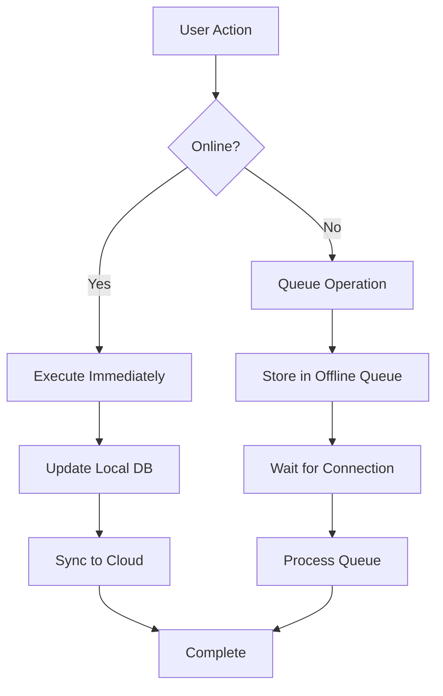
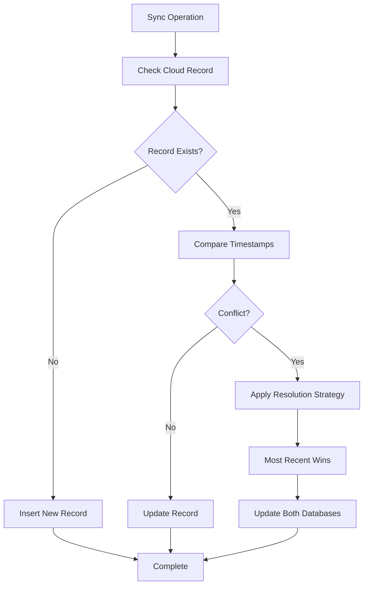
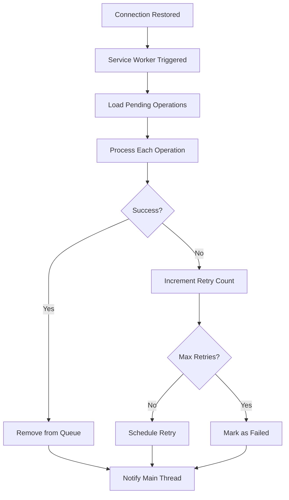

# Offline-First Sync System

The VaikunthaPOS sync system provides robust offline-first functionality with automatic conflict resolution and background synchronization between local SQLite and Turso cloud databases.

## Architecture Overview

```
┌─────────────────┐    ┌─────────────────┐    ┌─────────────────┐
│   Local SQLite  │    │  Offline Queue  │    │  Turso Cloud    │
│   (Primary DB)  │◄──►│   (IndexedDB)   │◄──►│   (Sync DB)     │
└─────────────────┘    └─────────────────┘    └─────────────────┘
         ▲                       ▲                       ▲
         │                       │                       │
         ▼                       ▼                       ▼
┌─────────────────┐    ┌─────────────────┐    ┌─────────────────┐
│ Connection      │    │ Service Worker  │    │ Conflict        │
│ Monitor         │    │ Background Sync │    │ Resolution      │
└─────────────────┘    └─────────────────┘    └─────────────────┘
```

## Key Components

### 1. Connection Monitor (`src/lib/utils/connection.ts`)

Monitors network connectivity and provides real-time status updates.

**Features:**
- Online/offline detection
- Connection type and quality monitoring
- Periodic health checks
- React hooks for UI integration

**Usage:**
```typescript
import { useConnectionStatus, connectionMonitor } from '@/lib/utils/connection';

// In React components
const connectionStatus = useConnectionStatus();

// Programmatic access
const isOnline = connectionMonitor.isOnline();
const status = connectionMonitor.getStatus();
```

### 2. Offline Queue (`src/services/database/offlineQueue.ts`)

Manages operations that need to be synchronized when connectivity is restored.

**Features:**
- Priority-based operation queuing
- Automatic retry with exponential backoff
- Dependency management
- Persistent storage in localStorage

**Usage:**
```typescript
import { offlineQueue } from '@/services/database/offlineQueue';

// Queue an operation
const operationId = offlineQueue.enqueue({
  type: 'create',
  tableName: 'products',
  data: productData,
  priority: 1,
  maxRetries: 3
});

// Process queue manually
await offlineQueue.processQueue();
```

### 3. Sync Service (`src/services/database/sync.ts`)

Orchestrates bidirectional synchronization between local and cloud databases.

**Features:**
- Bidirectional sync (local ↔ cloud)
- Timestamp-based conflict resolution
- Automatic sync scheduling
- Real-time sync status updates

**Usage:**
```typescript
import { syncService } from '@/services/database/sync';

// Perform full sync
const result = await syncService.performFullSync();

// Queue operation for sync
const operationId = syncService.queueOperation('update', 'users', userData);

// Subscribe to sync status
const unsubscribe = syncService.subscribeSyncStatus((status) => {
  console.log('Sync status:', status);
});
```

### 4. Service Worker (`public/sw-sync.js`)

Provides background synchronization capabilities.

**Features:**
- Background sync when app is closed
- IndexedDB integration for persistent queues
- Automatic retry mechanisms
- Client notification system

### 5. UI Components

#### SyncStatus Components (`src/components/common/SyncStatus.tsx`)

Provides visual indicators for sync status.

**Components:**
- `SyncStatusBadge`: Compact status indicator
- `SyncStatusPanel`: Detailed status panel
- `SyncStatusIndicator`: Configurable status display

**Usage:**
```tsx
import { SyncStatusBadge, SyncStatusPanel } from '@/components/common/SyncStatus';

// Compact badge
<SyncStatusBadge className="ml-4" />

// Detailed panel
<SyncStatusPanel className="mb-6" />
```

## Sync Process Flow

### 1. Operation Queuing



### 2. Conflict Resolution



### 3. Background Sync



## Configuration

### Environment Variables

```env
# Turso Cloud Database
TURSO_DATABASE_URL=libsql://your-database.turso.io
TURSO_AUTH_TOKEN=your-auth-token

# Sync Settings (optional)
SYNC_INTERVAL=300000  # 5 minutes
MAX_RETRY_ATTEMPTS=3
RETRY_BACKOFF_BASE=1000  # 1 second
```

### Sync Settings

```typescript
// src/lib/config/sync.ts
export const syncConfig = {
  autoSyncInterval: 5 * 60 * 1000, // 5 minutes
  maxRetries: 3,
  retryBackoffBase: 1000, // 1 second
  conflictResolution: 'timestamp', // 'timestamp' | 'manual'
  enableBackgroundSync: true,
  queueStorageKey: 'offline_queue',
};
```

## API Reference

### SyncService

#### Methods

- `performFullSync(): Promise<SyncResult>`
- `syncToCloud(): Promise<SyncResult>`
- `syncFromCloud(): Promise<SyncResult>`
- `queueOperation(type, tableName, data, priority?): string`
- `subscribeSyncStatus(listener): () => void`
- `getSyncStatus(tableName): Promise<SyncMetadata | null>`
- `updateSyncStatus(tableName, lastSyncAt, version?): Promise<void>`

#### Types

```typescript
interface SyncResult {
  success: boolean;
  tablesProcessed: number;
  recordsSynced: number;
  conflicts: number;
  errors: string[];
}

interface SyncStatus {
  isOnline: boolean;
  isSyncing: boolean;
  lastSyncAt: Date | null;
  pendingOperations: number;
  errors: string[];
}
```

### OfflineQueue

#### Methods

- `enqueue(operation): string`
- `dequeue(id): boolean`
- `processQueue(): Promise<void>`
- `getStats(): QueueStats`
- `subscribe(listener): () => void`
- `clear(): void`
- `retryFailed(): void`

#### Types

```typescript
interface QueuedOperation {
  id: string;
  type: 'create' | 'update' | 'delete';
  tableName: string;
  data: any;
  timestamp: number;
  retryCount: number;
  maxRetries: number;
  priority: number;
  dependencies?: string[];
}

interface QueueStats {
  totalOperations: number;
  pendingOperations: number;
  failedOperations: number;
  completedOperations: number;
}
```

### ConnectionMonitor

#### Methods

- `getStatus(): ConnectionStatus`
- `isOnline(): boolean`
- `subscribe(listener): () => void`
- `destroy(): void`

#### Types

```typescript
interface ConnectionStatus {
  isOnline: boolean;
  connectionType?: 'wifi' | 'cellular' | 'ethernet' | 'unknown';
  effectiveType?: '2g' | '3g' | '4g' | 'slow-2g';
  downlink?: number;
  rtt?: number;
}
```

## Testing

### Unit Tests

Run sync system tests:

```bash
pnpm test tests/unit/services/sync.test.ts
pnpm test tests/unit/services/offlineQueue.test.ts
pnpm test tests/unit/utils/connection.test.ts
```

### Integration Testing

The sync system includes comprehensive integration tests that verify:

- End-to-end sync operations
- Conflict resolution scenarios
- Network failure recovery
- Background sync functionality

### Manual Testing

Use the sync demo component to manually test sync functionality:

```tsx
import { SyncDemo } from '@/components/common/SyncDemo';

// Add to your development pages
<SyncDemo />
```

## Best Practices

### 1. Operation Design

- Keep operations idempotent
- Use meaningful operation IDs
- Set appropriate priorities
- Handle dependencies correctly

### 2. Conflict Resolution

- Design data models to minimize conflicts
- Use timestamp-based resolution for most cases
- Implement custom resolution for critical data
- Log conflicts for analysis

### 3. Performance

- Batch operations when possible
- Use appropriate sync intervals
- Monitor queue sizes
- Implement data pagination for large syncs

### 4. Error Handling

- Implement proper retry strategies
- Log sync errors for debugging
- Provide user feedback for sync issues
- Handle network timeouts gracefully

### 5. Security

- Validate all sync operations
- Use secure authentication tokens
- Implement proper authorization checks
- Sanitize data before sync

## Troubleshooting

### Common Issues

1. **Sync Not Working**
   - Check network connectivity
   - Verify Turso credentials
   - Check browser console for errors
   - Verify service worker registration

2. **High Conflict Rates**
   - Review data model design
   - Check timestamp accuracy
   - Implement better conflict resolution
   - Consider data partitioning

3. **Performance Issues**
   - Monitor sync operation sizes
   - Implement data pagination
   - Optimize database queries
   - Reduce sync frequency

4. **Queue Growing Too Large**
   - Check network stability
   - Verify API endpoints
   - Implement queue size limits
   - Add queue cleanup mechanisms

### Debug Tools

Enable debug logging:

```typescript
// In browser console
localStorage.setItem('debug', 'sync:*');
```

Monitor sync metrics:

```typescript
// Get detailed sync statistics
const stats = await syncService.getAllSyncStatuses();
const queueStats = offlineQueue.getStats();
console.log('Sync Stats:', { stats, queueStats });
```

## Future Enhancements

- [ ] Selective sync (table/record filtering)
- [ ] Compressed sync payloads
- [ ] Real-time sync via WebSockets
- [ ] Advanced conflict resolution strategies
- [ ] Sync analytics and monitoring
- [ ] Multi-tenant sync isolation
- [ ] Encrypted sync for sensitive data